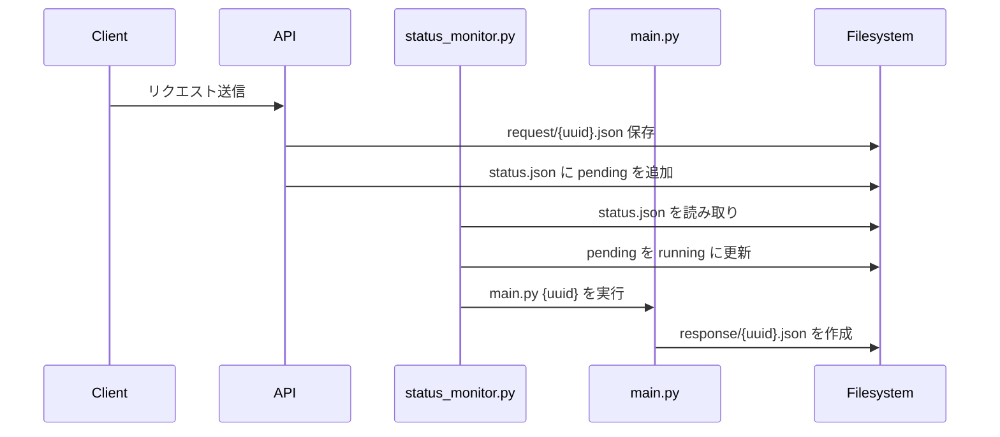

※ChatGPTによる解説をそのまま貼る。

# ジョブ監視・処理システムの概要

このリポジトリは、Web API 経由で受け取ったリクエスト（ジョブ）をファイルで管理し、定期的に監視・処理するシンプルなバッチ実行構成です。

---

## 🎯 目的

- クライアントから送られたジョブをファイルベースで保存・管理
- 30秒ごとに未処理のジョブを検出・実行
- 実行結果を別ファイルに保存

---

## 🧱 ディレクトリ構成とファイルの役割

```
/shared/bcrlapi/
├── request/
│ ├── status.json ← すべてのジョブの状態を記録
│ └── {uuid}.json ← 各リクエストの詳細
└── response/
└── {uuid}.json ← 処理結果を保存
```


- `status.json`: すべてのジョブとそのステータスを保持（`pending`, `running`, `completed` など）
- `request/{uuid}.json`: 個々のジョブリクエストの内容
- `response/{uuid}.json`: 処理完了後に出力されるレスポンスファイル

---

## 🧠 status_monitor.py の役割（監視担当）

`status_monitor.py` は一定間隔（30秒）でジョブ一覧を監視し、未処理のジョブがある場合に処理を開始します。

### 処理手順

1. `status.json` を読み込む
2. `status == "pending"` のジョブを 1 件探す
3. 該当ジョブのステータスを `running` に変更し、ファイルを更新
4. 該当ジョブの `req_id` を引数として `main.py` を実行

---

## 🛠️ main.py の役割（処理担当）

- 引数で渡された `req_id` に対応するリクエストを読み込む（テスト時はダミー使用）
- 処理（今回は固定レスポンスを生成）を行い、`response/{uuid}.json` に保存
- 処理の内容をログに出力

---

## 💡 処理の流れ


# ⏱️ パフォーマンス（status.json 書き換え時間）
ファイル全体を書き換える形式でも、以下のような高速な処理が可能です：

| ジョブ件数  | 書き込み所要時間   |
| ------ | ---------- |
| 10     | 約 0.0003 秒 |
| 100    | 約 0.0027 秒 |
| 1,000  | 約 0.022 秒  |
| 5,000  | 約 0.13 秒   |
| 10,000 | 約 0.23 秒   |
| 20,000 | 約 0.43 秒   |

# 🚀 拡張案
- 並列処理対応（複数ジョブの同時処理）
- completed へのステータス更新ロジックの追加
- request/response ファイルの保存形式の最適化（DB化など）

# 🧪 テスト
初期構成では、main.py はダミーのレスポンスを固定的に出力します。実際のロジックを入れることで、リアルな処理に切り替えることが可能です。