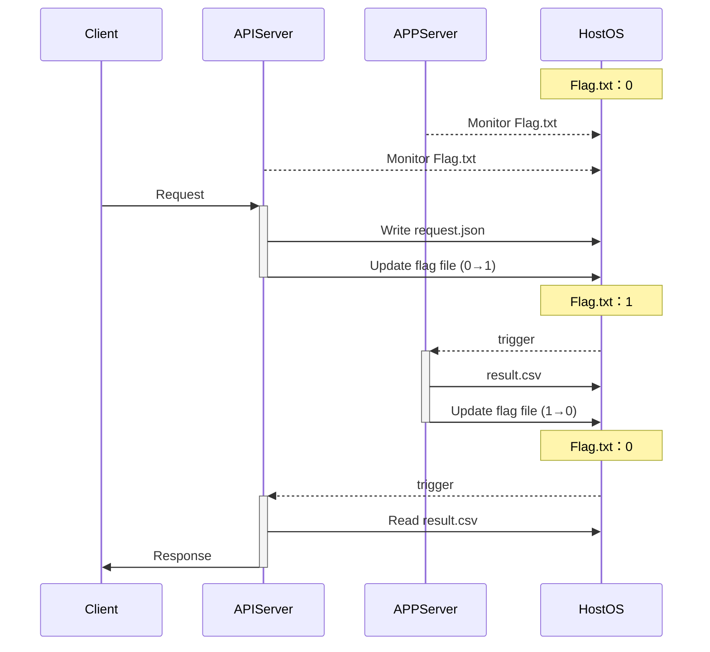

```mermaid
sequenceDiagram
    participant Client
    participant api as APIServer
    participant app as APPServer
    participant host as HostOS

    note over host: Flag.txt：0
    app-->>host: Monitor Flag.txt
    api-->>host: Monitor Flag.txt

    Client->>+api: Request
    api->>host: Write request.json
    api->>-host: Update flag file (0→1)
    note over host: Flag.txt：1

    host-->>+app: trigger

    app->>host: result.csv
    app->>-host: Update flag file (1→0)
    note over host: Flag.txt：0

    host-->>+api: trigger

    api->>host: Read result.csv
    api->>-Client: Response
```