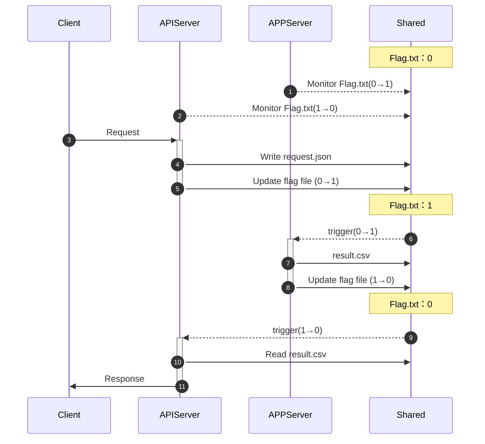

```mermaid
sequenceDiagram
    autonumber
    participant Client
    participant api as APIServer
    participant app as APPServer
    participant host as Shared

    note over host: Flag.txt：0
    app-->>host: Monitor Flag.txt(0→1)
    api-->>host: Monitor Flag.txt(1→0)

    Client->>+api: Request
    api->>host: Write request.json
    api->>-host: Update flag file (0→1)
    note over host: Flag.txt：1

    host-->>+app: trigger(0→1)

    app->>host: result.csv
    app->>-host: Update flag file (1→0)
    note over host: Flag.txt：0

    host-->>+api: trigger(1→0)

    api->>host: Read result.csv
    api->>-Client: Response
```