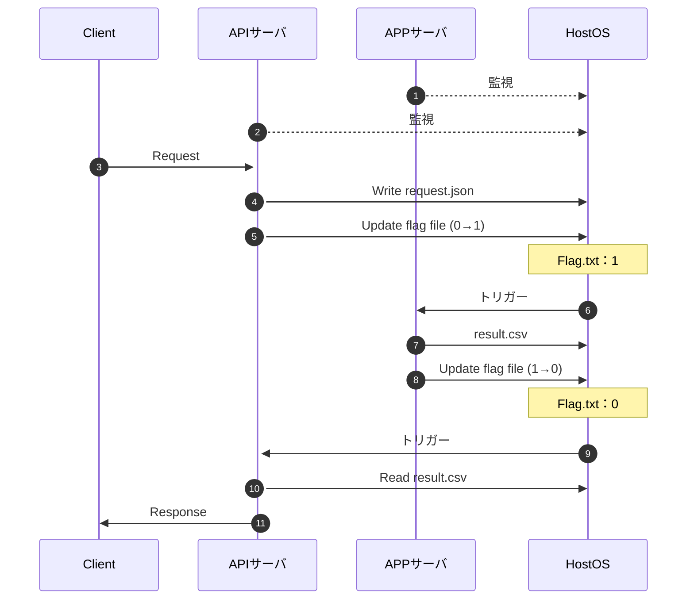

```mermaid
sequenceDiagram
    autonumber
    participant Client
    participant api as APIサーバ
    participant app as APPサーバ
    participant host as HostOS

    app-->>host: 監視
    api-->>host: 監視

    Client->>+api: Request
    api->>host: Write request.json
    api->>host: Update flag file (0→1)
    note over host: Flag.txt：1

    host->>app: トリガー

    app->>host: result.csv
    app->>host: Update flag file (1→0)
    note over host: Flag.txt：0

    host->>api: トリガー
    api->>host: Read result.csv
    api->>Client: Response
```